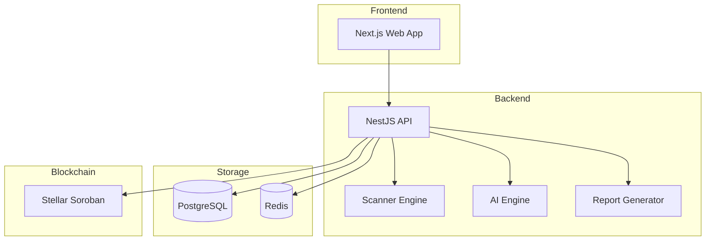
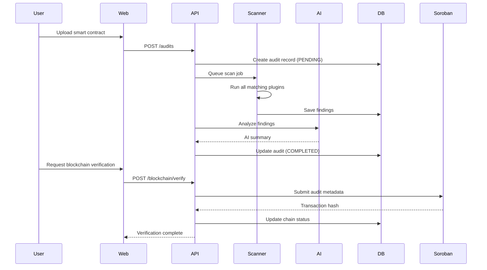

# Architecture

## High-Level Overview



## Package Design

### Dependency Flow

```
config (tsconfig, eslint)
  └── shared (types, enums, utils, dtos)
        ├── scanner-types (plugin interfaces)
        │     ├── scanner-core (engine)
        │     └── plugins/* (rules)
        ├── database (Prisma)
        │     └── auth (JWT, RBAC)
        ├── logger
        ├── ai-engine (provider abstraction)
        ├── parser (contract parsing)
        ├── report-generator
        ├── sdk (API client)
        └── ui (components)
```

### Key Design Decisions

1. **Plugin Architecture**: Scanner-core has zero knowledge of individual plugins. Plugins implement `IRulePlugin` from `@veridion/scanner-types`, and composition happens via the `PluginRegistry`.

2. **AI Provider Abstraction**: The `AiService` class accepts an `AiProvider` interface. Swap providers without changing business logic.

3. **Domain-Driven Design**: The NestJS backend organizes modules by domain (users, projects, audits, reports) rather than by technical layer.

4. **Shared Validation**: Zod schemas in `@veridion/shared/dtos` provide validation shared between frontend (React Hook Form) and backend (class-validator).

## Data Flow: Audit Scan



## Module Structure

### apps/api/src/modules/

```
auth/              # Authentication & authorization
  controllers/     # REST endpoints
  services/        # Business logic
  strategies/      # Passport strategies (JWT, API Key)
  guards/          # Auth guards
  dto/             # Request/response DTOs

projects/          # Project CRUD
audits/            # Audit creation & management
reports/           # Report generation
ai/                # AI chat & analysis
blockchain/        # On-chain verification
notifications/     # User notifications
users/             # User profiles
health/            # Health checks
```

## Scanner Plugin Architecture

Each plugin:
- Implements `IRulePlugin` from `@veridion/scanner-types`
- Contains metadata (severity, category, chains, languages)
- Has zero dependencies on scanner-core
- Is registered dynamically via `PluginRegistry`

```typescript
interface IRulePlugin {
  readonly metadata: PluginMetadata;
  initialize(config?: Record<string, unknown>): Promise<void>;
  analyze(context: AnalysisContext): Promise<FindingResult[]>;
  getFixRecommendation(finding: FindingResult): string;
  supportsContext(context: AnalysisContext): boolean;
}
```

## Security Architecture

- **Authentication**: JWT access tokens (15min) + refresh tokens (7d)
- **Authorization**: Role-based (USER, AUDITOR, ADMIN) with granular permissions
- **API Keys**: For programmatic access with configurable permissions
- **Rate Limiting**: 100 requests/minute per IP
- **Input Validation**: Class-validator + Zod schemas
- **Output Sanitization**: Helmet, CORS, secure headers

## Performance

- **Caching**: Redis for session data, rate limiting, and queue results
- **Queue System**: BullMQ for async scan jobs and AI processing
- **Code Splitting**: Next.js dynamic imports and route-based splitting
- **Pagination**: Cursor and offset-based pagination on all list endpoints
